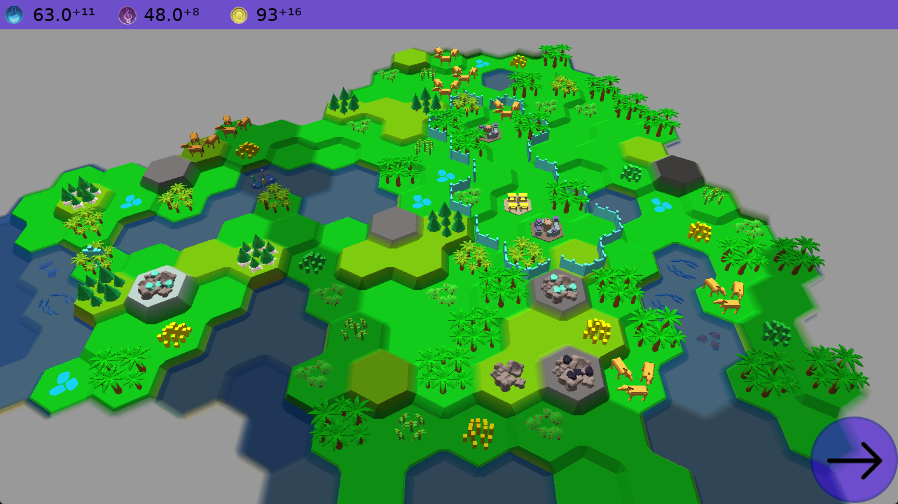
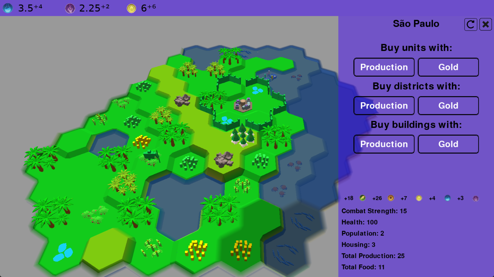

<h1>Documentation: PyKingdom project</h1>

__Authors:__ Vornicescu Vasile, Ursu Vasile, Condorache Alexandru  
__github:__ https://github.com/vorni22/PyKingdom

__Overview:__ 
PyKingdom is supposed to be a simple yet interactive 4X game
you can play with friends in a hot seat scenario. It was designed
to incorporate core aspects of every popular 4X game
(Civilization series, Humankind and others) but remain simple
and easy to play.
 

__Technical details:__ 
The main programming language used is python. Every major aspect
of the game is handled in python, starting from the rendering pypeline
to the game logic and UI. 
>Other used technologies:
>* __glsl__ shading language: Used to write the main shader
that display the map in combination with OpenGL.
>* __OpenGL__ used to configure the rendering pipeline.
>* __pyGame__ mainly used for rendering UI and configuring the window.
>* __Blender__ modeling tool: Used to create every game object (city,
districts, units and resources).

Other python pakages where used like numpy or pyrr but are too
generic to be mentioned here.

> __Usage:__  
> __Important note:__ The game was tested on the Windows operating system
> on 3 different systems, however it also run on Linux but can run in
> issues like the windows resolution not being right causing it to not
> fit perfectly on the screen. If such problems are encountered find in the
> code where the window is created and change it resolution accordingly. 
> 
> In order to run the game follow those instructions:
> * Make sure you have __python__ installed on your system.
> * Create a __virtual environment__ in the project's root.
> * Install on the created venv all packages from __requirements.txt__ file.
> * Run the __main.py__ file with the new venv

The game will greet you with a menu. Press play and some map settings will
appear where you could set different map parameters like map size and number
of players int the game. After everything is right press the middle button
and the game will begin.

__Problems, fixes and potential changes:__ 
During developing we encountered a lot of unexpected issues that led to
a more lengthy process of developing. Here are some of them:
* __Problem 1:__ The hardest problem encountered while developing the game was mixing pygame
with OpenGL. Since we wanted to draw the UI with pygame instead of OpenGL (doing so
would be much more complex than already is), we needed a way to draw things
using pygame on top of a OpenGL framebuffer.  
    * __Solution:__ To solve the issue, we convert every frame the OpenGL framebuffer, after every game object is drawn,
to a pygame surface. Then, using pygame, the UI is drawn on the obtained
surface. After everything is ready, we convert back the surface to a 
OpenGL texture which then will be rendered on the screen.
    * __Drawback:__ Because we convert the framebuffer to a surface and
back every frame, most of the frame time will be spent on this operation. We
did not find a way to make this faster without entirely changing the way
we handle UI. The reason of it being so slow, is because the conversions described
above take place on the CPU and not GPU.
    * __Potential future fix:__ The best way to fix this would be to handle
the UI natively with OpenGL. We did not do this from the start because it is much
harder to achieve, however not having to switch contexts like this, it will
dramatically improve the game performance.
* __Problem 2:__ Making the game fullscreen on all platforms (including Linux, where we
currently have problems).
    * __Solution__: On Windows systems, we let the system automatically
pick the 'right' resolution for the window, however on Ubuntu the resolution
picked is not really 'right'.
    * __Drawback:__ We lose a lot of control over the window resolution.
It cannot be changed or adjusted in game.
    * __Potential future fix:__ Just a better window system or entirely
giving up to pygame, since most of the resolution problems appeared because
of it.
* __Problem 3:__ Handling a 'non-square' game grid. Since our geometry of
choice are hexagons, handling the map grid is much harder. For example,
a simple task like finding adjacent tiles is not so trivial.
    * __Solution__: We converted the entire grid to a graph.
Every time we want to find some information about distances between tiles,
we just find the distance between 2 nodes in the graph, which is much simpler.
* __Problem 4:__ Compatibility issues because of glsl and OpenGL. During testing
we encountered a lot of strange issues that appeared only on some older systems.
We figured the main cause of those issues is the way different
drivers compile the glsl shader language into binary code. Some modern GPU drivers
try to avoid undefined behavior occurring in the future at compile time, consequently
some issues that appear on older GPUs are hidden when testing on more modern systems.
    * __Solution:__ We refactored the rendering pipeline multiple times
making sure such undefined behaviors do not occurred. We focused our testing
to devices that proved during developing to be more problematic.
    * __Potential issues:__ The problem with such compatibility issues is
that you cannot be 100% sure that the program will allways run on every system.
Because our testing pool is very small, consisting of our own devices and some other
devices of some friends, we probably left some problems unsolved. 
There even was a problem found on some old computer (2009) where everything
was black and white, no colors and the UI was handled wrong.
* __Problem 5:__ PyGame has a poor events handling.
    * __Solution:__ We had to manually handle all interactions. 
We created two cycles for checking events: the first cycle handles events that 
occur when the game is not in the running game state and extracts information 
about a tile. The second cycle handles actions during the running game state, 
managing player interactions with units and cities. In some cases, such as 
moving units or buying districts, we also had to count the number of clicks. 
For example, when a player wants to move a unit, the first click presses 
the move button, and the second click must be on a tile where the unit 
can move.
  * __Drawback:__ Sometimes, when clicking the action a player wants to execute, 
the action may be performed on the second click instead of the first. 
This issue occurs because we have two cycles for checking events, 
and sometimes the event could be read by the first cycle. 
We couldn't change this because we use PyGame for rendering the UI during 
gameplay, and we render the UI on a surface that may be None in some cases

Even though we identified some problems, we are happy with the final result.
We learned a lot from this project and given more time we would probably
fix the other major issues we currently have.

>Our __work__ distribution in the team:
> + __Graphics__ (rendering pipeline, shaders and 3D models): Vornicescu Vasile
> + __Map generation__: Vornicescu Vasile
> + __Game logic__: Ursu Vasile
> + __Game UI__: Condorache Alexandru
> + __Putting it all together__ (integrating all above-mentioned together): Ursu Vasile and Condorache Alexandru

Some game screenshots:

